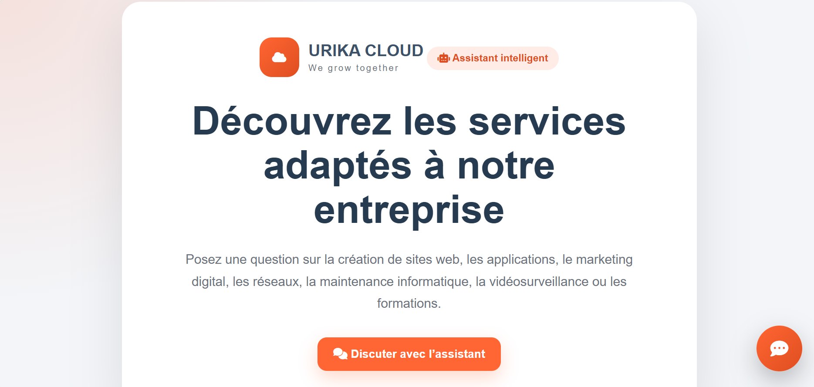
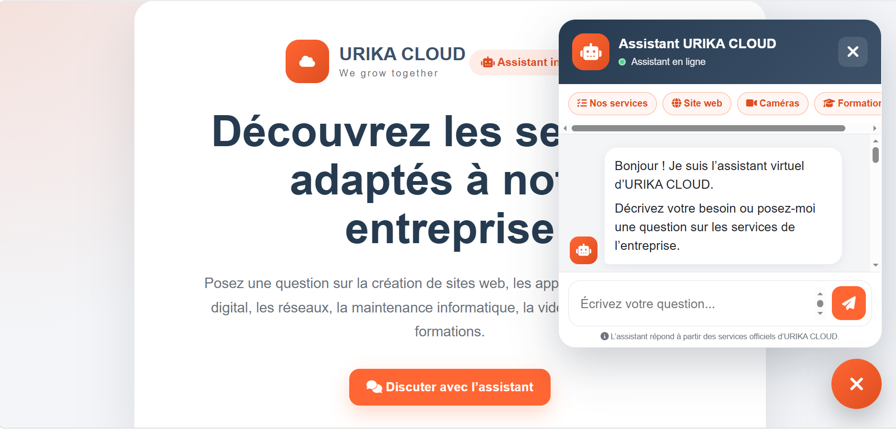
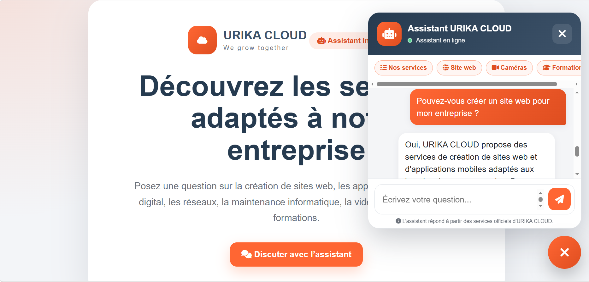

# Chatbot URIKA CLOUD

> Assistant virtuel intelligent permettant aux visiteurs de découvrir les services proposés par URIKA CLOUD et d’obtenir des réponses claires.

## À propos

Le projet consiste à développer un chatbot destiné au site web d’URIKA CLOUD.

Le visiteur peut poser une question concernant les services de l’entreprise.  
L’interface JavaScript envoie la question à un backend FastAPI, qui transmet ensuite la demande à l’API OpenAI.

Le chatbot utilise uniquement les informations présentes dans le fichier `backend/services.txt`.

Il ne doit jamais inventer :

- un service ;
- un prix ;
- un délai ;
- une information non validée par l’entreprise.

Les conversations ne sont pas enregistrées de manière permanente.

## Table des matières

- [Aperçu](#aperçu)
- [Fonctionnalités](#fonctionnalités)
- [Services couverts](#services-couverts)
- [Technologies](#technologies)
- [Structure du projet](#structure-du-projet)
- [Installation](#installation)
- [Configuration](#configuration)
- [Utilisation](#utilisation)
- [Référence API](#référence-api)
- [Tests](#tests)
- [Auteur](#auteur)

## Aperçu

<p align="center">
  
</p>

<p align="center">
  
</p>

<p align="center">
  
</p>

## Fonctionnalités

- Interface de chatbot flottante.
- Ouverture et fermeture avec animation.
- Interface responsive pour ordinateur, tablette et téléphone.
- Questions suggérées pour faciliter la navigation.
- Envoi d’un message avec le bouton ou la touche `Entrée`.
- Animation pendant la préparation de la réponse.
- Appel sécurisé du backend FastAPI.
- Connexion du backend à l’API OpenAI.
- Réponses générées à partir des services officiels d’URIKA CLOUD.
- Limitation des messages à 800 caractères.
- Gestion des erreurs réseau et serveur.
- Réponses en français.

## Services couverts

Le chatbot peut répondre aux questions concernant les services suivants :

1. Création de sites web et d’applications mobiles.
2. Création de plateformes e-commerce, marketplace et e-learning.
3. Marketing digital, community management et référencement SEO.
4. Solutions ERP, CRM, codes-barres et QR codes.
5. Maintenance informatique matérielle et logicielle.
6. Infogérance.
7. Installation et maintenance des réseaux informatiques.
8. Installation et maintenance des caméras de vidéosurveillance.
9. Formations.

## Technologies

| Couche | Technologie |
|---|---|
| Frontend | HTML5, CSS3, JavaScript |
| Icônes | Font Awesome |
| Backend | Python, FastAPI |
| Serveur local | Uvicorn |
| Validation | Pydantic |
| Variables d’environnement | python-dotenv |
| Intelligence artificielle | API OpenAI |
| Format des données | JSON |
| Versionnement | Git et GitHub |

## Structure du projet

```text
URIKA-CHATBOT/
├── assets/
│   ├── chatbot-page.png
│   ├── chatbot-open.png
│   └── chatbot-question.png
│
├── frontend/
│   ├── index.html
│   ├── style.css
│   └── script.js
│
├── backend/
│   ├── main.py
│   ├── services.txt
│   ├── requirements.txt
│   ├── .env.example
│   ├── .env
│   └── .venv/
│
├── .gitignore
└── README.md
```


## Installation

### 1. Cloner le dépôt

```bash
git clone URL_DU_DEPOT
cd urika-chatbot
```


### 2. Accéder au backend

Sous PowerShell :

```powershell
cd backend
```

### 3. Créer l’environnement virtuel

```powershell
py -m venv .venv
```

### 4. Installer les dépendances

```powershell
.\.venv\Scripts\python.exe -m pip install --upgrade pip
.\.venv\Scripts\python.exe -m pip install -r requirements.txt
```

Le fichier `backend/requirements.txt` contient :

```text
fastapi
uvicorn[standard]
openai
python-dotenv
pydantic
```

## Configuration

### Variables d’environnement

Créer un fichier :

```text
backend/.env
```

Ajouter :

```env
OPENAI_API_KEY=VOTRE_CLE_OPENAI
OPENAI_MODEL=NOM_DU_MODELE_AUTORISE
```


## Utilisation

1. Ouvrir la page du chatbot.
2. Cliquer sur le bouton flottant en bas à droite.
3. Écrire une question.
4. Cliquer sur l’icône d’envoi ou appuyer sur `Entrée`.
5. Attendre la réponse de l’assistant.
6. Utiliser les questions suggérées si nécessaire.

Exemples :

```text
Quels services propose URIKA CLOUD ?
```

```text
Pouvez-vous créer un site web pour mon entreprise ?
```

```text
Proposez-vous des formations ?
```

```text
Installez-vous des caméras de vidéosurveillance ?
```

## Référence API

Toutes les réponses du backend utilisent le format JSON.

| Méthode | Route | Description |
|---|---|---|
| GET | `/` | Retourne les informations générales du service |
| GET | `/health` | Vérifie que le backend fonctionne |
| POST | `/chat` | Envoie une question au chatbot |

### `GET /`

Exemple de réponse :

```json
{
  "service": "Chatbot URIKA CLOUD",
  "status": "running"
}
```

### `GET /health`

Exemple de réponse :

```json
{
  "status": "ok",
  "service": "URIKA CLOUD chatbot"
}
```

### `POST /chat`

Corps de la requête :

```json
{
  "message": "Quels services propose URIKA CLOUD ?"
}
```

Réponse réussie :

```json
{
  "status": "success",
  "answer": "URIKA CLOUD propose plusieurs services..."
}
```


## Tests

### Questions relatives aux services

```text
Pouvez-vous créer une application mobile ?
```

```text
Je souhaite ouvrir une boutique en ligne.
```

```text
Pouvez-vous gérer les réseaux sociaux de mon entreprise ?
```

```text
Je cherche une solution CRM.
```

```text
Pouvez-vous installer un réseau informatique ?
```


### Configuration du serveur

Sur le serveur, l’administrateur doit configurer :

```env
OPENAI_API_KEY=VALEUR_SECRETE
OPENAI_MODEL=NOM_DU_MODELE
```

Puis installer les dépendances :

```bash
pip install -r requirements.txt
```

## Auteur

**Malak Boukhita** 

Projet réalisé dans le cadre du développement d’un chatbot intelligent pour URIKA CLOUD.